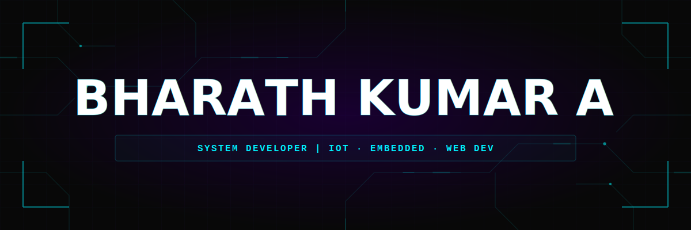
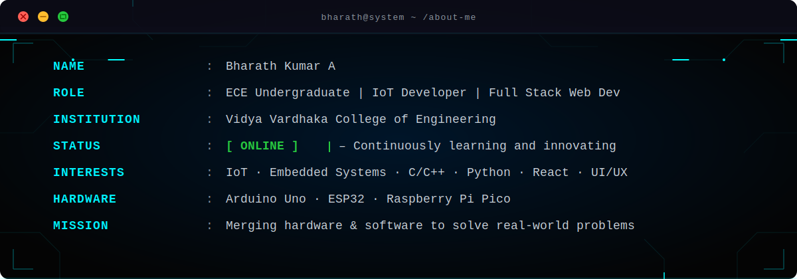
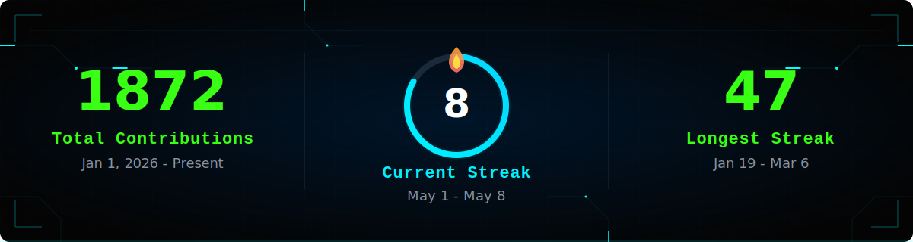
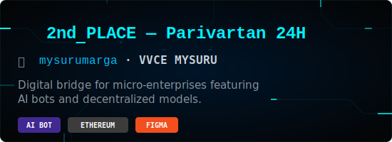
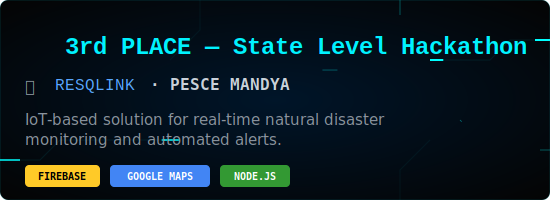
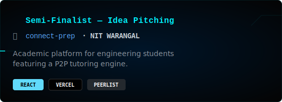
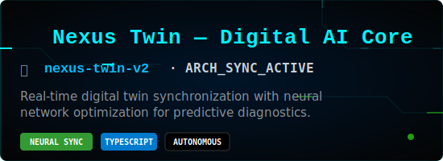
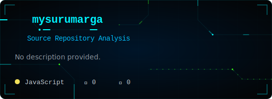
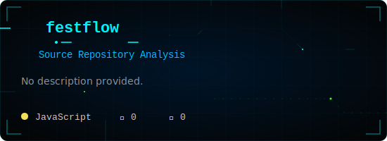
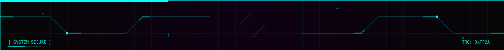

<h1> ⚡ Welcome to my Digital Workspace ⚡ </h1>

&nbsp;&nbsp;&nbsp;

&nbsp;&nbsp;&nbsp;

&nbsp;&nbsp;&nbsp;

# 👤 ABOUT_ME

  
  
  

  

---

 

## 🛠️ Tech Stack

  
  
  
  
  
  
  
  
  
  
  
  
  
  

# 📊 GitHub Stats:

  

  

  
# 🏆 MISSION_LOG / ACHIEVEMENTS

  <table border="0">
    <tr>
      <td></td>
      <td></td>
    </tr>
    <tr>
      <td></td>
      <td></td>
    </tr>
  </table>

# 🚀 REPOS_DEEP_DIVE / FEATURED_PROJECTS

  <table border="0">
    <tr>
      <td></td>
      <td></td>
    </tr>
    <tr>
      <td></td>
      <td></td>
    </tr>
  </table>

 

  

